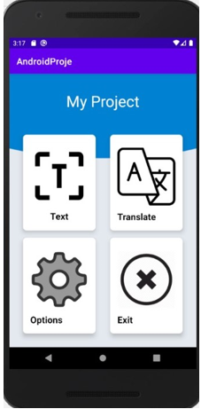

# TextRecoginition-and-Translate

## **Proje Tanımı**
Projemiz Android Studio ile geliştirilmiş olup görüntü üzerinde ki metin tespiti ve translation işlemleri yapmaktadır. 
Translation kısmı için firebase translate apisini kullandık

### **Projenin Amacı**
Uygulamamız telefonumuzun yerel kamerasından çekilen resimler ile veya galerimiz de  yüklediğimiz resimlerin içinde bulunan metni tespit eder isterseniz bu tespit edilen metni  bize text olarak sunar veya isterseniz bu texti yaklaşık 52 adet dil desteği olan translate sayfasında çeviri yapabilmesine olanak sağlar.

Projenin Ana Ekranı           |  Projenin OCR Kısmı       
:-------------------------:|:-------------------------: 
  |   |    

| Projenin Translate Kısmı  | Projenin Options Kısmı
:-------------------------:|:-------------------------:
 | |  

### **Projenin OCR Kısmı**
Bu kısımda Projenin Anasayfasında Text kısmına giriş yaptıktan sonra telefon galerisinden bir resim seçmemizi veya kameradan bir fotoğraf çekmemiz beklenmektedir.

### **Projenin Translate Kısmı**
Translate kısmında hangi diller arasında translate yapılmak isteniyorsa ilk önce bu dillerin paketinin indirilmesi gerekir.İndirilen paketleri Delete Model butonuna tıklanması durumunda uygulamanızdan veri depolama alanında tasarruf edebilirsiniz.

### **Projenin Options Kısmı**
Options Kısmında uygulamanın kullanacağı dili seçiyoruz:Türkçe,İngilizce,Çince dil desteği bulunmaktadır.
